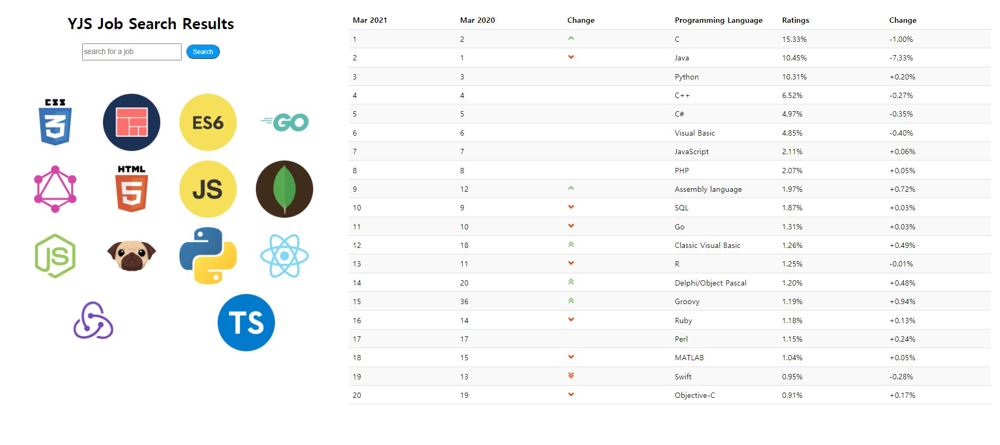
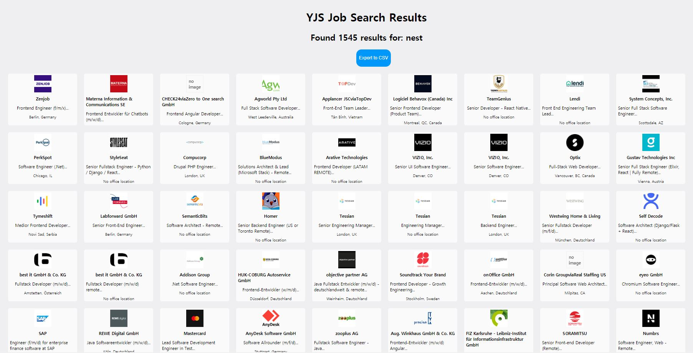

# Job 스크래퍼 프로젝트

## 프로젝트 내용
파이썬 언어로 웹 크롤링을 이용하여 3개의 구인 사이트의 모집공고를 스크랩합니다.

조회하고자 하는 검색어로 웹 사이트에 Beatiful soap을 이용하여 검색하고
검색된 결과를 대시보드 목록으로 볼 수 있으며 CSV 파일로 출력할 수 있습니다.

메인 화면에서는 작년대비 올해 관심 프로그래밍 언어의 변동표를 확인할 수 있습니다.

파이썬과 웹 크롤링 스터디를 위하여 개인적으로 만든 프로그램입니다.

## 주요 기능
- Tiobe 사이트를 크롤링하여 관심 프로그래밍 변동표 스크랩 및 대시보드 확인
- 한번의 검색으로 3개 사이트의 통합 구인 모집공고 검색
- 검색된 모집공고 목록을 CSV 파일로 저장

## 사용 기술

## 링크
[https://job-scrapper.jungsikyeo.repl.co](https://job-scrapper.jungsikyeo.repl.co)

## 스크린샷

